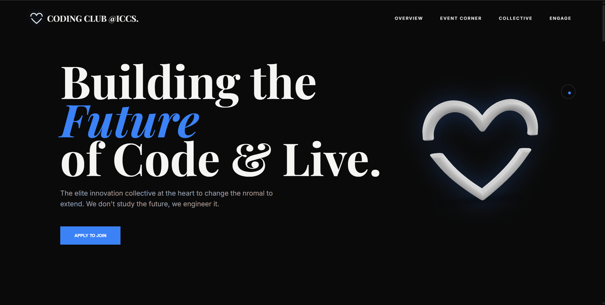
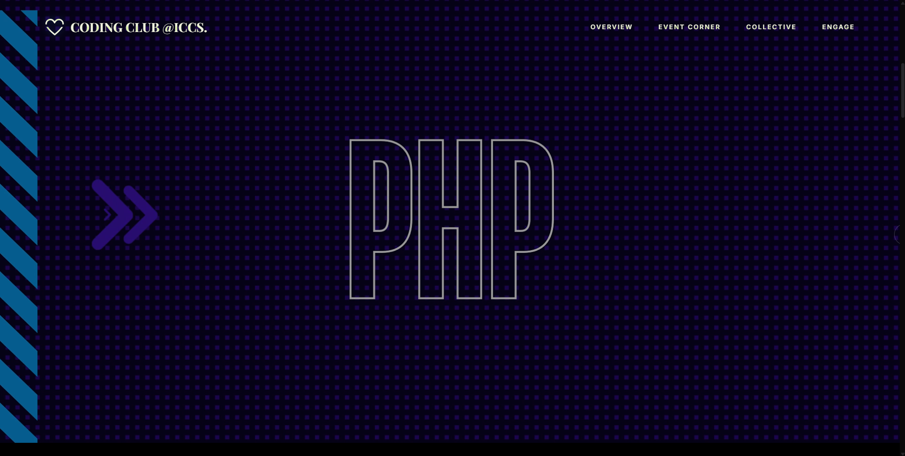
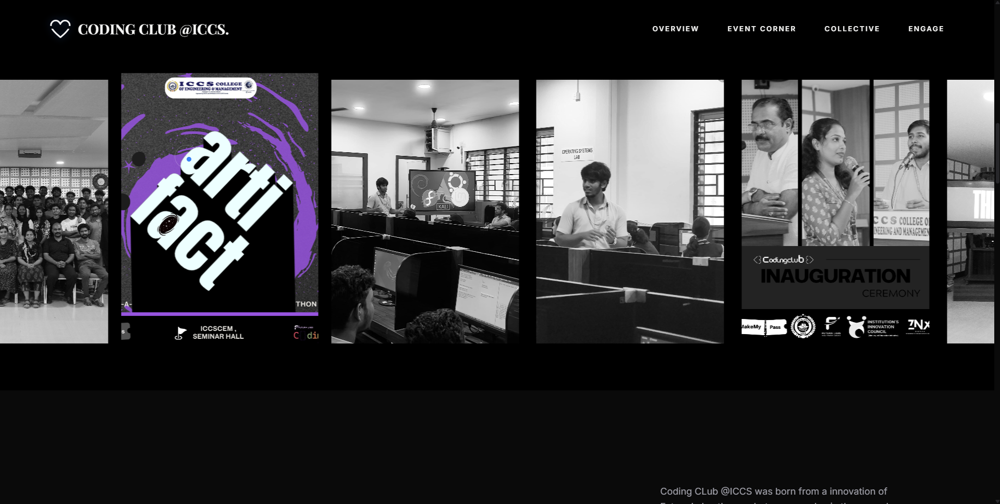
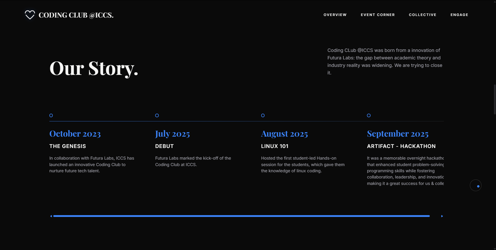
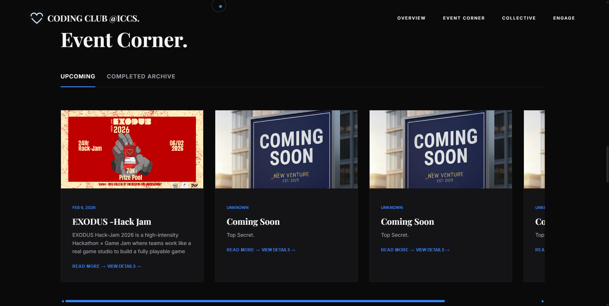
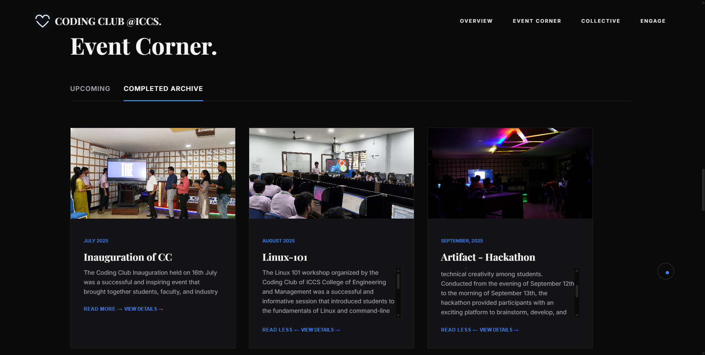
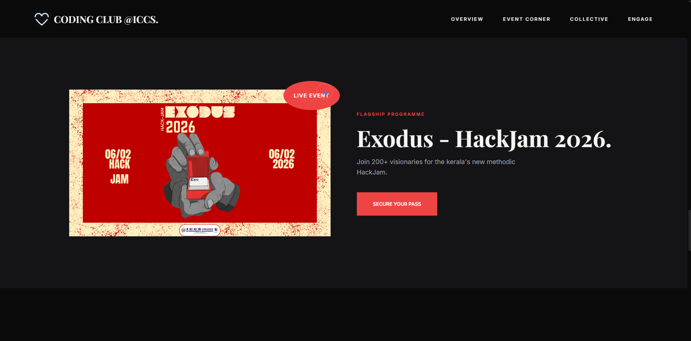
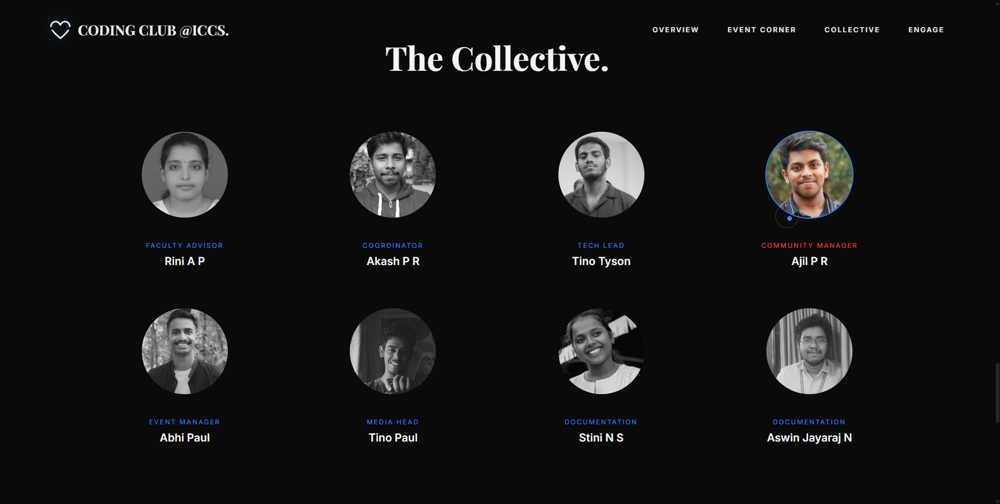
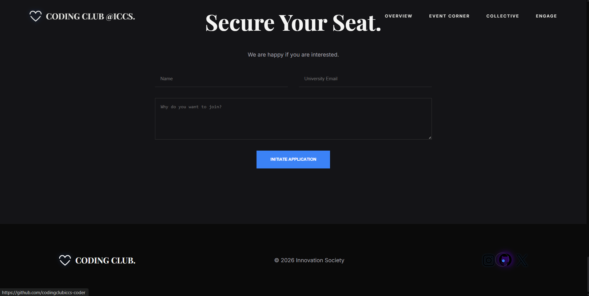

# 🚀 Coding Club @ ICCS — Elite Innovation & Leadership Collective

An interactive, premium-grade landing page and server-side backend built to showcase the journey, community, and tech events of the **Coding Club at ICCS College of Engineering and Management (Thrissur)**, in collaboration with **Futura Labs**. 

This portal acts as a gateway for students to engage with workshops, participate in overnight hackathons, track their achievements, and apply for membership.

Developed and maintained by **[Ajil P R (Ajil017)](https://github.com/Ajil017)**.

---

## ✨ Features

### 🌟 Premium Frontend Experience
* **Custom Cursor Follower**: A responsive, custom-styled liquid cursor follower that moves smoothly based on desktop interaction.
* **3D Interactive Graphics**: Seamless implementation of the Google `<model-viewer>` component to render and auto-rotate a 3D heart model (`heart_model.glb`).
* **Infinite Image Slider**: A looping, high-performance marquee-style slider showcasing memories from previous tech gatherings.
* **Dynamic Event Archive**: Tabbed switching between **Upcoming** and **Completed** events. Includes interactive "Read More" logs, stats tracker, and logos of co-hosting partners.
* **Responsive Visuals**: Completely hand-crafted vanilla CSS layout that scales fluidly from small mobile screens to large desktop monitors.

### 🛡️ Robust Backend System
* **Express.js API Server**: Custom routing for processing membership requests and event registrations.
* **Firebase Firestore Integration**: Real-time storage of member details and applications securely using Firebase SDK.
* **Automated Nodemailer Alerts**: Triggers real-time email notification directly to coordinators whenever a student registers or submits a request.
* **CORS Protection & Logging**: Secure cross-origin resource sharing controls and timestamp-based server logging middleware.

---

## 🛠️ Tech Stack

| Layer | Technologies Used |
| :--- | :--- |
| **Frontend** | HTML5, Vanilla CSS3, JavaScript (ES6+), Google `<model-viewer>` |
| **Backend** | Node.js, Express.js |
| **Database** | Firebase Firestore (Google Cloud) |
| **Services** | Nodemailer SMTP (Gmail Integration) |
| **Dependencies** | `cors`, `body-parser`, `firebase-admin`, `nodemailer` |

---

## 📂 Repository Structure

```
├── images/                   # Asset folder for events, team, logos, and 3D models
│   ├── cc/                   # Member profiles
│   ├── partners/             # Logos of partner firms (Futura Labs, Zionyx, etc.)
│   ├── icons/                # SVG social icons
│   └── heart_model.glb       # 3D interactive model asset
├── index.html                # Main frontend presentation file
├── server.js                 # Node.js backend server code
├── package.json              # App metadata and dependency listing
├── package-lock.json         # Lockfile for exact dependency versions
├── .gitignore                # Safeguard for private config keys and packages
└── README.md                 # Project documentation (this file)
```

---

## 🚀 Setup & Installation

Follow these steps to run the Coding Club website locally:

### Prerequisites
* [Node.js](https://nodejs.org/) (v16+ recommended)
* A [Firebase Console](https://console.firebase.google.com/) account
* Gmail account with App Password configured for SMTP mail transmission

### 1. Clone the Project
```bash
git clone https://github.com/Ajil017/Coding-Club-Webpage.git
cd Coding-Club-Webpage
```

### 2. Install Dependencies
Install all server dependencies listed in `package.json`:
```bash
npm install
```

### 3. Setup Firebase credentials
1. Go to your **Firebase Project Console**.
2. Click **Project Settings** > **Service Accounts**.
3. Click **Generate New Private Key**.
4. Download the JSON key file and rename it to `serviceAccountKey.json`.
5. Place this file in the root directory of the project alongside `server.js`.
> ⚠️ **IMPORTANT**: Never commit `serviceAccountKey.json` to GitHub. It contains private API credentials. Make sure it is listed in your `.gitignore`.

### 4. Run the Backend Server
Start the development server:
```bash
npm start
```
The console will log:
```
NEXUS Backend Service online.
Listening on port: 3000
Press Ctrl+C to terminate.
```

### 5. Launch the Frontend
Simply double-click or host `index.html` on a local live-server (e.g., VS Code Live Server extension). The frontend is set to submit forms to `http://localhost:3000/api/apply`.

---

## 📬 API Specification

### Apply for Membership / Register
* **Endpoint**: `POST /api/apply`
* **Content-Type**: `application/json`
* **Request Body**:
  ```json
  {
    "name": "Jane Doe",
    "email": "jane@example.edu",
    "message": "I want to participate in the upcoming HackJam",
    "timestamp": "2026-06-30T11:00:00.000Z"
  }
  ```
* **Success Response (201 Created)**:
  ```json
  {
    "success": true,
    "referenceId": "FirestoreGeneratedDocID"
  }
  ```

---

## 🤝 Contribution Guidelines

Contributions are welcome! If you want to add new modules, update timelines, or introduce new event cards:
1. Fork the repository.
2. Create a feature branch: `git checkout -b feature/AmazingFeature`
3. Commit your changes: `git commit -m 'Add some AmazingFeature'`
4. Push to the branch: `git push origin feature/AmazingFeature`
5. Open a Pull Request.

---

## 🖼️ Project Overview











---

## 📄 License

Distributed under the **ISC License**. See `LICENSE` or check the repository for details.

Developed with 💻 & 💙 by **[Ajil P R](https://github.com/Ajil017)**.
